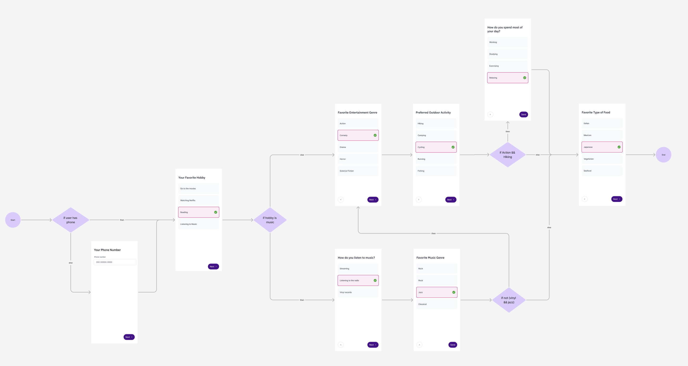

# Desafio Técnico

## **Submissão do projeto**

Siga os seguintes passos para realizar sua entrega.

1. Faça um download .zip deste repositório público, clicando **[aqui](https://github.com/Cidadania-Ja/quizzer/archive/refs/heads/main.zip)**.
2. Crie um repositório seu **privado** e suba um commit inicial com o conteúdo do .zip.
3. Deixe a main com esse estado inicial e crie uma branch separada para realizar suas mudanças.
4. Ao final, crie um **Pull Request (PR)** dessa sua branch para a main.
5. Adicione estes dois colaboradores no seu repositório privado: **@FernandoTancini** e **@GuilhermeAlbert**.

Pronto, assim conseguiremos revisar sua entrega!

## **Sobre o projeto**

O projeto foi construído com **[React Native](https://reactnative.dev/)** e utiliza **styled-components** para estilização.

- A aplicação possui um **fluxo de perguntas**, que guia o usuário através de diferentes tipos de entrada para captação de informações.
- Os componentes suportam **inputs de texto e select-options**, garantindo flexibilidade na coleta de dados.

## Tarefas

O objetivo deste desafio é construir um **sistema dinâmico de quizzes**, baseado no arquivo JSON `questions.json`. O quiz deve permitir **fluxos flexíveis**, dependendo das respostas do usuário, e **adaptar dinamicamente às perguntas exibidas**.



[Clique aqui para ver a imagem em tela cheia](https://raw.githubusercontent.com/Cidadania-Ja/quizzer/refs/heads/main/docs/flow.png)

## Tarefas a serem implementadas

- [ ] **Construa o arquivo JSON conforme especificações**

  - O seu sistema deve permitir que possamos fazer qualquer mudança ou incremento nesse fluxo com apenas edições deste arquivo JSON. Sendo assim, todas as configurações, regras de exibição, condicionais e afins, devem estar necessariamente escritas nele.

- [ ] **Implemente no aplicativo o fluxo de quizz baseado no protocolo descrito em JSON**

  - Você deve implementar o que definiu no JSON, como funcionalidade do aplicativo. Lembrando que a aplicação deve ser capaz de se comportar seguindo as infinitas possibilidades de fluxos no JSON, seguindo o protocolo criado por você.

- [ ] **Crie um Stepper Dinâmico**

  - O Stepper deve:
    - Exibir **a posição atual** do usuário no quiz.
    - Exibir **quantas perguntas faltam** para finalizar.
    - Se adaptar dinamicamente, contabilizando quantos **passos já passaram** e uma previsão atual de **quantos passos faltam**.

- [ ] **Capture e Exiba as Respostas**

  - Implemente um **estado global** para armazenar as respostas do usuário.
  - Ao finalizar o quiz, exiba um `Alert.alert()` com as respostas no formato key/value.

    - **Exemplo:**

      ```json
      {
        "phone_number": "+5536999885589",
        "favorite_hobby": "Reading",
        "preferred_genre": "Sci-Fi",
        "outdoor_activity": "Hiking",
        "food_preference": "Italian",
        "daily_activity": "Working"
      }
      ```

  - O sistema deve permitir que as respostas sejam **facilmente enviadas para uma API futuramente**.

## Dicas

### **O que será avaliado?**

- **Flexibilidade do código:** O quiz deve se adaptar dinamicamente ao JSON. Você deve deixar o JSON otimizado, e bem configurado. Faça as ajustes, condições e configurações, imaginando que futuramente mudaremos apenas o JSON para lançar novos fluxos imagináveis.
- **Uso adequado de estados:** O controle de navegação e respostas deve ser eficiente.
- **Código organizado e reutilizável:** O projeto deve seguir boas práticas de desenvolvimento.
- A parte visual e de **interface não deve ser o foco** e, por isso, não há necessidade de investir tempo nela.

### **Sobre permissões e boa fé:**

- Você pode instalar novas dependências nos projetos, via yarn. (porém, neste desafio, não deve ser necessário)
- Você pode pesquisar na internet ou utilizar AI, como no dia-a-dia de um programador.
- ⚠️ Lembre-se: esta é uma etapa assíncrona para avaliar **suas habilidades** e você será desclassificado se, posteriormente, identificarmos que não possui domínio sobre a sua entrega feita nesta etapa.

---

Boa sorte e divirta-se no desafio! 🚀
